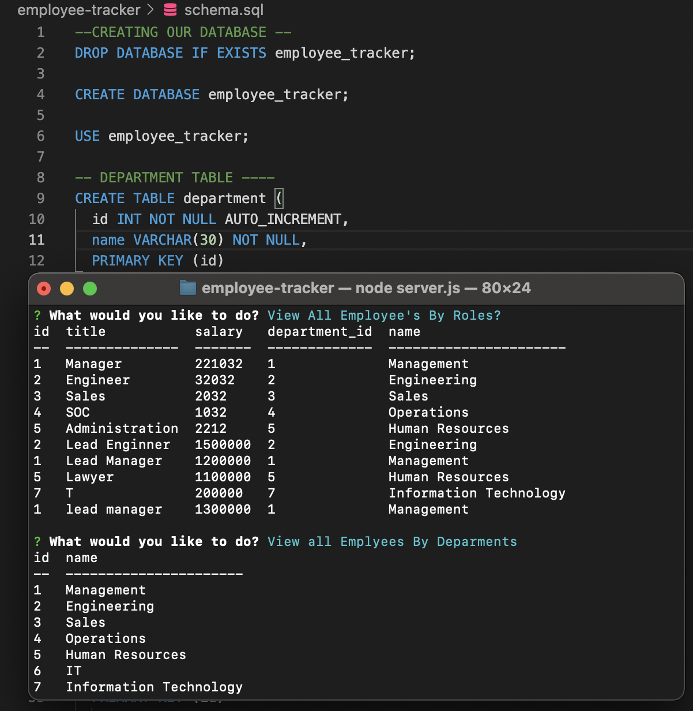

# employee-tracker
Homework-12

This application is a CLI application that allow maintaining companies employee data base. Anyone within the company can view all employees, roles, and departments as well.

## LINK TO THE REPOSITORY

-  [employee-tracker](https://github.com/LShuqair/employee-tracker)

## LINK TO THE VIDEO

-  [employee-tracker](https://drive.google.com/file/d/1i6oeX56DmaUN4UaNkTEMc2vRgW96Zqzv/view?usp=sharing)

## Code Snippet

